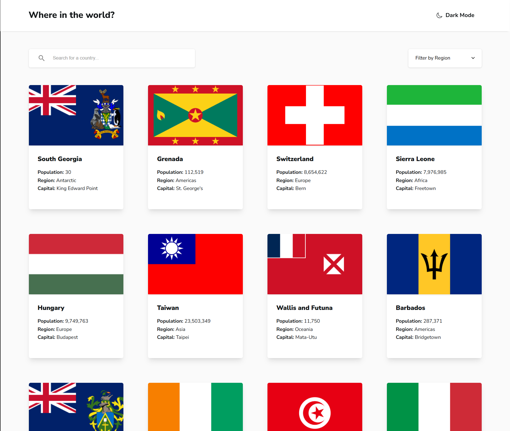

# Frontend Mentor - REST Countries API with color theme switcher solution

This is a solution to the [REST Countries API with color theme switcher challenge on Frontend Mentor](https://www.frontendmentor.io/challenges/rest-countries-api-with-color-theme-switcher-5cacc469fec04111f7b848ca).

## Table of contents

- [Overview](#overview)
  - [The challenge](#the-challenge)
  - [Screenshot](#screenshot)
- [My process](#my-process)
  - [Built with](#built-with)
  - [What I learned](#what-i-learned)

## Overview

### The challenge

Users should be able to:

- See all countries from the API on the homepage
- Search for a country using an `input` field
- Filter countries by region
- Click on a country to see more detailed information on a separate page
- Click through to the border countries on the detail page
- Toggle the color scheme between light and dark mode.

### Screenshot

## My process

### Built with

- Semantic HTML5 markup
- CSS custom properties
- Flexbox
- CSS Grid
- React
- RESTful API

### What I learned

- Using APIs: I learned how to work with RESTful APIs in a React application to fetch and manipulate data, including retrieving, processing, and displaying information in components.
- JavaScript and JSX Skills: I enhanced my JavaScript skills, particularly in using JSX syntax, which combines HTML and JavaScript, and in managing state and props in React.
- Component-Based Architecture: I built reusable components, which is a core concept in React, allowing for better code organization and maintainability.
- State Management: I gained experience in managing component state and understanding how to lift state up when necessary, as well as using hooks like useState and useEffect.
- Styling in React: I explored different ways to style my components, including CSS modules, styled-components, or traditional CSS, and successfully implemented theme switching.
- Error Handling: I learned how to handle errors during API calls and provide clear error messages to users, as well as manage loading states.
- Version Control: I used Git for project management, which helped me understand the basics of version control and collaboration with other developers.
- Responsive Design: I improved my skills in creating responsive layouts that work well on various screen sizes, using CSS.
